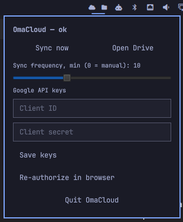

# OmaCloud

Google Drive client for [Omarchy](https://omarchy.org/). It combines
`rclone` sync (mount + bi-sync) with a Quickshell (QML) bar widget for
status and actions.

**Status: working v0.1.1.** It mounts your Drive at `~/Drive`, keeps a local
replica synced every 15 min as a user service, and shows status in the bar
(cloud click = force sync, folder click = open Drive).



## Layout

- `backend/` — `omacloud-bisync` wrapper + systemd units (mount, bisync, timer)
- `shell/omacloud/` — Omarchy plugin (`manifest.json` + QML)
- `install.sh` — idempotent bilingual (ES/EN) installer

## Why your own API keys?

rclone ships a shared Google OAuth `client_id` that Google is retiring
during 2026 — relying on it stops working without warning. Your own
Desktop-app credentials give you:

- **No dependency on rclone's shared quota/retirement schedule.**
- **Control:** you own the consent screen, test users and revocation
  (see INSTALL.md step 2).
- **Privacy:** tokens are issued to your project, not a shared one.

## Install

Quick way:

```bash
git clone https://github.com/imarin/OmaCloud.git ~/OmaCloud && ~/OmaCloud/install.sh
```

Step-by-step guide: [INSTALL.md](INSTALL.md) · [Guía en español](INSTALL.es.md).

## Requirements

- Omarchy (Arch Linux + Hyprland + Quickshell)
- `rclone`
- Google account with Drive access (uses your own OAuth client_id;
  details in INSTALL.md)
